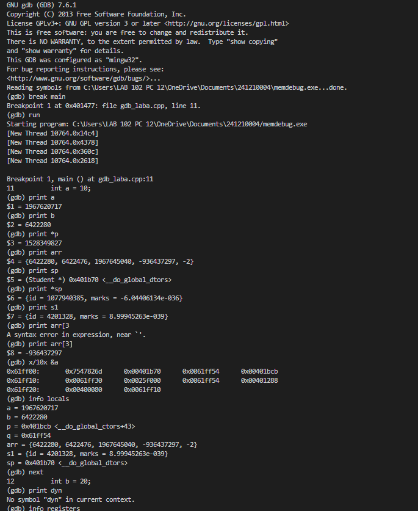
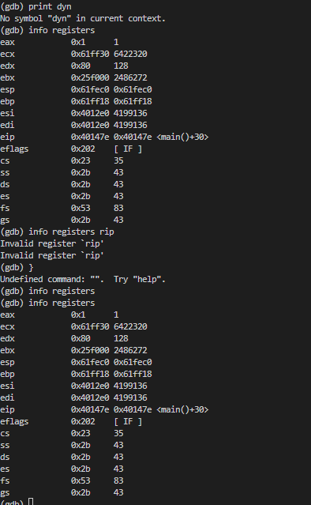

# Experiment 4 – GNU Debugger (GDB)

## COMPUTER ARCHITECTURE AND ORGANIZATION LABORATORY

---

## 1. Aim / Objective

To study the GNU Debugger (GDB) and use it to analyze the flow of a C++ program. This includes:

- Setting breakpoints  
- Inspecting variable values  
- Examining memory addresses  
- Viewing CPU registers  
- Stepping through program execution  

---

## 2. Theory

GNU Debugger (GDB) is a powerful command-line debugging tool for programs written in C, C++, Fortran, and other languages. It allows a programmer to:

- Observe program execution in real-time  
- Analyze program behavior during crashes  

### Key Capabilities of GDB

- **Breakpoints:** Pause execution at a specified line or function  
- **Watchpoints:** Pause execution when a variable changes  
- **Step Execution:**  
  - `next (n)` → step over  
  - `step (s)` → step into  
- **Variable Inspection:** `print <var>`  
- **Memory Examination:** `x/<n><f> <addr>`  
- **Register Inspection:** `info registers`  
- **Stack Trace:** `backtrace (bt)`  

### Compilation with Debug Symbols

```bash
g++ -g gdb_laba.cpp -o memdebug.exe
````

---

## 3. Program Under Study (gdb_laba.cpp)

The program demonstrates:

* Integer variables
* Pointers
* Arrays
* User-defined structures

.png>)

---

## 4. GDB Commands Used

| Command                | Description          |
| ---------------------- | -------------------- |
| `gdb <program>`        | Launch GDB           |
| `break main / break N` | Set breakpoint       |
| `run`                  | Execute program      |
| `next (n)`             | Step over            |
| `step (s)`             | Step into            |
| `print <var>`          | Print variable       |
| `info locals`          | Show local variables |
| `info registers`       | Show CPU registers   |
| `x/<n><f> <addr>`      | Examine memory       |
| `backtrace (bt)`       | Show call stack      |
| `quit (q)`             | Exit GDB             |

---

## 5. Procedure

1. Compile program with debug flag:

   ```bash
   g++ -g gdb_laba.cpp -o memdebug.exe
   ```

2. Launch GDB:

   ```bash
   gdb memdebug.exe
   ```

3. Set breakpoint:

   ```bash
   break main
   ```

4. Run program:

   ```bash
   run
   ```

5. Inspect variables:

   ```bash
   print a
   print b
   print *p
   ```

6. Inspect arrays:

   ```bash
   print arr
   print arr[3]
   ```

7. Inspect struct pointer:

   ```bash
   print sp
   print *sp
   ```

8. Examine memory:

   ```bash
   x/10x &a
   ```

9. View local variables:

   ```bash
   info locals
   ```

10. View registers:

```bash
info registers
```

11. Step execution:

```bash
next
```

12. Exit:

```bash
quit
```

---

## 6. GDB Session Screenshots


* **Fig. 2:** Breakpoint, variable inspection, memory examination, step execution


* **Fig. 3:** CPU register values


---

## 7. Observations

* Breakpoint at `main()` worked correctly
* Uninitialized variables showed garbage values
* Pointer dereferencing using `print *p` worked correctly
* Memory layout observed using `x/10x &a`
* `info locals` displayed all variables
* `info registers` showed CPU state
* Step execution updated values correctly

---

## 8. Result

The GNU Debugger (GDB) was successfully used to analyze the execution of a C++ program. All debugging features such as:

* Breakpoints
* Variable inspection
* Memory analysis
* Register viewing

were successfully demonstrated.

GDB proved to be an effective tool for low-level program debugging and analysis.

