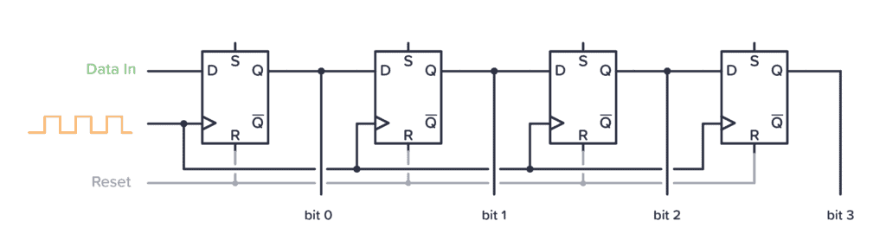
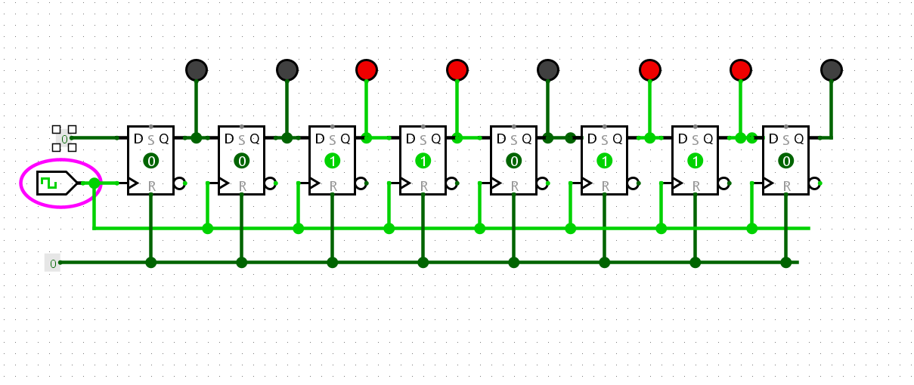

# Experiment 05 — 8-bit Shift Register using Flip-Flops

## Aim

To design and simulate an **8-bit shift register** using flip-flops in Logisim and observe the shifting of data.

**Components Used:**
- 8 × D Flip-Flops  
- Clock  
- Input Pin (for serial data)  
- LED Output Pins (Q0–Q7)  
- Wiring Tools  

---

## Theory

An **8-bit shift register** is a sequential digital circuit constructed using eight flip-flops connected in series. It is used to store binary data and shift it from one stage to another with each clock pulse.

In this experiment, a **Serial-In Serial-Out (SISO)** shift register is implemented. Data is entered serially into the first flip-flop and shifts through each stage sequentially on every clock pulse.

Shift registers are widely used in:
- Data storage  
- Data transfer  
- Serial communication  

---

## Procedure

1. Open Logisim and create a new circuit.
2. Place **eight D flip-flops** from the memory components section.
3. Arrange the flip-flops in a straight line.
4. Add a **clock** and connect it to all flip-flops.
5. Place an **input pin** for serial data and connect it to the first flip-flop.
6. Connect:
   - Output (Q) of each flip-flop → Input (D) of the next flip-flop
7. Attach **LEDs/output pins** to each flip-flop output (Q0–Q7).
8. Start the simulation.
9. Apply input data and observe shifting with each clock pulse.

---

## Circuit Diagram

---

## Working

- Data is entered serially into the first flip-flop.
- On every clock pulse:
  - Each bit shifts to the next flip-flop.
- The data propagates step-by-step through all 8 stages.
- LEDs display the output at each stage.

---

## Output / Simulation

---

## Result

The **8-bit shift register** was successfully designed and simulated using Logisim.

- Data shifted correctly across all stages.
- Each clock pulse moved the data forward by one position.
- The circuit behaved as a **Serial-In Serial-Out (SISO)** shift register.

---

## Conclusion

The experiment verified the working of a shift register using D flip-flops. The observed behavior matched the theoretical concept of sequential data shifting, confirming correct circuit operation.

---

## Applications

- Serial data transfer  
- Data storage  
- Digital systems and communication circuits  

---