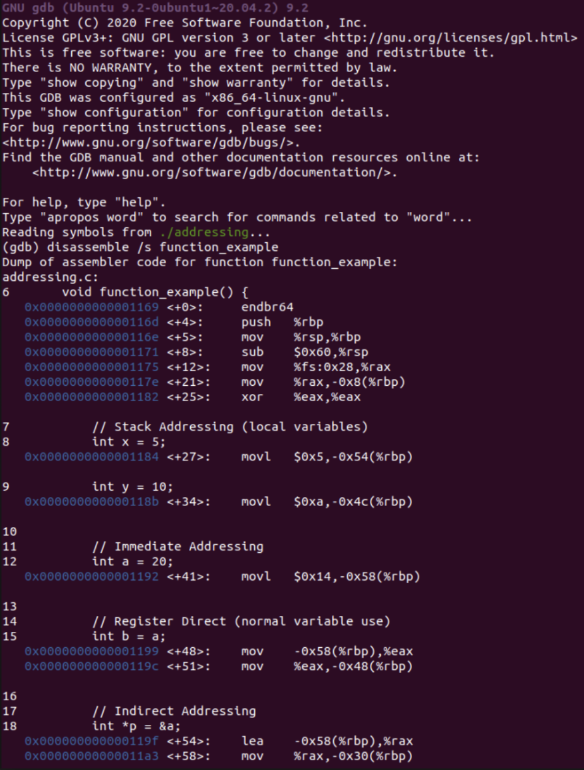
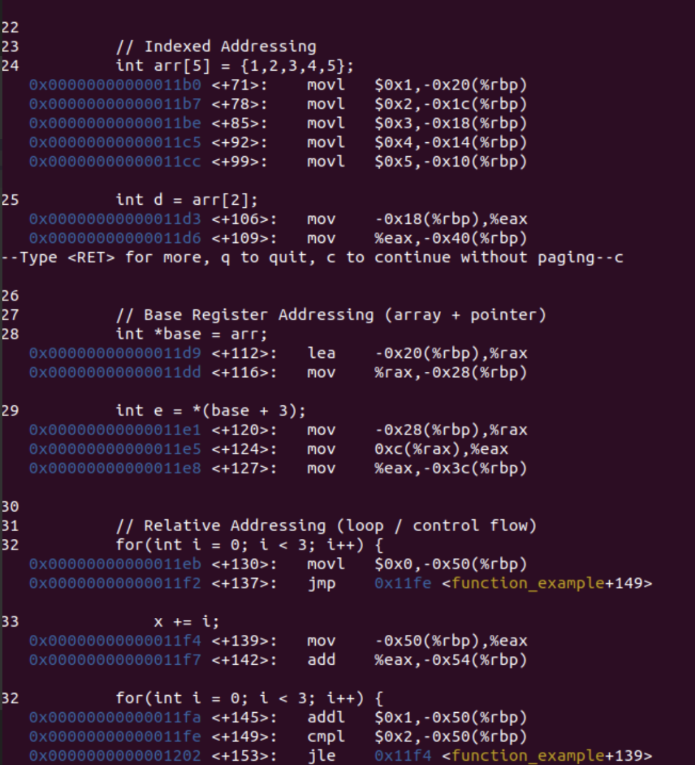
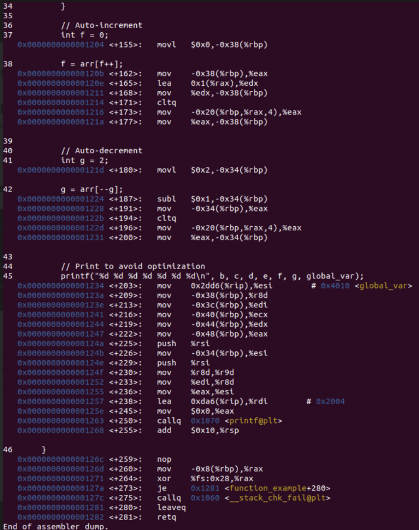

# Computer Organization & Architecture Lab  
## Experiment 05 — Study of Addressing Modes in C using GDB


## Aim

To study and implement various addressing modes in C and analyze their behavior using the GNU Debugger (GDB).

---

## Objective

- To understand different types of addressing modes  
- To implement addressing modes using C programming  
- To observe memory access and execution flow using GDB  

---

## Theory

Addressing modes define the way operands are accessed during the execution of instructions. They play a crucial role in determining how data is fetched from memory or registers.

### Types of Addressing Modes

#### 1. Immediate Addressing
In this mode, the operand value is directly specified in the instruction.
```c
int a = 20;
````

* No memory access required
* Fastest execution

---

#### 2. Direct Addressing

The memory address of the operand is directly accessed.

```c
int global_var = 50;
```

* Simple and straightforward
* Depends on fixed memory location

---

#### 3. Register Addressing

Operands are stored in CPU registers.

```c
int b = a;
```

* Faster than memory access
* Limited by register availability

---

#### 4. Indirect Addressing

Uses pointers to access memory indirectly.

```c
int *p = &a;
```

* Provides flexibility
* Used in dynamic memory operations

---

#### 5. Register Indirect Addressing

Accesses data using a pointer stored in a register.

```c
int c = *p;
```

* Common in pointer-based operations

---

#### 6. Indexed Addressing

Uses an index to access array elements.

```c
int d = arr[2];
```

* Address = base + index offset
* Useful for arrays and loops

---

#### 7. Base Register Addressing

Uses a base address with an offset.

```c
int e = *(base + 3);
```

* Widely used in memory addressing

---

#### 8. Relative Addressing

Used in control flow instructions like loops.

```c
for(int i = 0; i < 3; i++)
```

* Address is relative to current instruction

---

#### 9. Auto-Increment Addressing

Value is accessed and index is incremented automatically.

```c
f = arr[f++];
```

---

#### 10. Auto-Decrement Addressing

Value is accessed and index is decremented automatically.

```c
g = arr[--g];
```

---

## Algorithm / Procedure

1. Write a C program demonstrating different addressing modes
2. Compile the program using GCC compiler
3. Execute the program and verify outputs
4. Run the program using GDB debugger
5. Analyze:

   * Variable values
   * Memory addresses
   * Register usage
6. Record observations

---

## Program

```c
// Write your complete C program here
```

---

## Compilation & Execution

```bash
gcc program.c -o program
./program
```

---

## GDB Commands Used

```bash
gdb ./program
break main
run
next
print variable_name
continue
quit
```

---


### GDB Debugging Output

#### Screenshot 1



#### Screenshot 2



#### Screenshot 3



---

## Observations

* Immediate addressing is the fastest as it does not involve memory access
* Register addressing is faster than memory-based addressing
* Pointer-based addressing provides flexibility in memory handling
* Indexed and base addressing are useful in array operations
* GDB helps in visualizing memory and execution flow effectively

---

## Result

The experiment was successfully performed. Different addressing modes were implemented in C and analyzed using GDB. The working of memory access, registers, and execution flow was clearly understood.

---

## Conclusion

Addressing modes are fundamental to understanding how a processor accesses data. Through this experiment, we explored various addressing techniques and verified their behavior using debugging tools, enhancing our understanding of low-level program execution.

---

