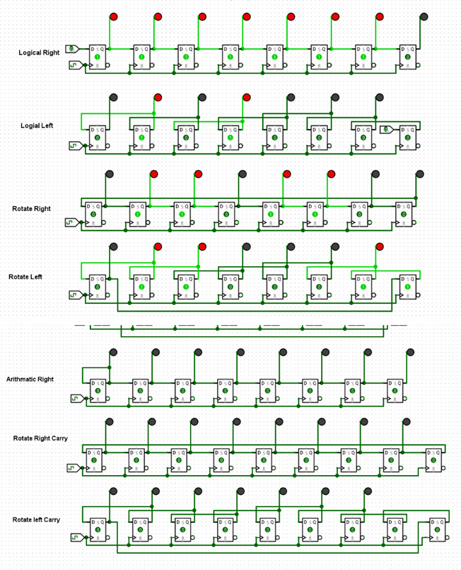

# COA Lab Experiment 07

## Aim
To implement logical instructions — LR, RS, Arithmetic Right Shift, Arithmetic Left Shift, RR, RL, RR with Carry, and RL with Carry — using an 8-bit shift register.

---

## Theory

Shift micro-operations are used to move bits left or right within a register. These operations are essential in tasks such as data storage, serial transmission, multiplication, division, and logical operations. They are often combined with arithmetic and logical operations for efficient data processing.

### Logical Shift

A logical shift moves bits in a register either to the left or right, inserting zeros into the vacant positions.

- **Logical Left Shift (LL):**
  - Each bit moves one position to the left.
  - Least Significant Bit (LSB) is filled with `0`.
  - Most Significant Bit (MSB) is discarded.
  - Used in multiplication of unsigned binary numbers.

- **Logical Right Shift (LR):**
  - Each bit moves one position to the right.
  - MSB is filled with `0`.
  - LSB is discarded.
  - Used in division of unsigned binary numbers.

---

### Arithmetic Shift

Arithmetic shifts are used for signed binary numbers.

- **Arithmetic Right Shift (ARS):**
  - Each bit shifts one position to the right.
  - LSB is discarded.
  - MSB is filled with the previous MSB (sign bit).
  - Used for division of signed binary numbers by powers of 2.

- **Arithmetic Left Shift (ALS):**
  - Similar to logical left shift.
  - Used for multiplication.

---

### Circular (Rotate) Shift

Circular shifts rotate bits within the register without loss of data.

- **Rotate Left (RL):**
  - Bits shift left by one position.
  - MSB is moved to the LSB position.

- **Rotate Right (RR):**
  - Bits shift right by one position.
  - LSB is moved to the MSB position.

---

### Rotate with Carry

Rotate operations can include a carry bit:

- **Rotate Left with Carry (RLC):**
  - MSB is moved to carry.
  - Carry is inserted into LSB.

- **Rotate Right with Carry (RRC):**
  - LSB is moved to carry.
  - Carry is inserted into MSB.

---

## Procedure

1. Designed an 8-bit shift register using flip-flops in the simulation environment / hardware setup.

2. Initialized the register with a sample 8-bit binary input.

3. Implemented control logic to perform different shift operations:
   - Logical Left Shift (LL)
   - Logical Right Shift (LR)
   - Arithmetic Right Shift (ARS)
   - Arithmetic Left Shift (ALS)
   - Rotate Left (RL)
   - Rotate Right (RR)
   - Rotate Left with Carry (RLC)
   - Rotate Right with Carry (RRC)

4. Applied clock pulses to trigger the shifting operations.

5. Observed the output for each operation and verified correctness based on expected results.

6. Tested the circuit with multiple input combinations to ensure proper working of all shift operations.

7. Recorded the outputs and captured screenshots for verification.

---

## Result

Successfully implemented shift instructions using an 8-bit shift register.

---

## Lab Implementation

---